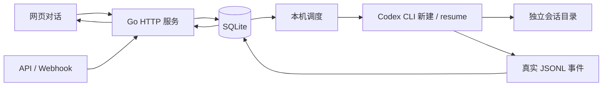

# Agent Platform 本机架构

> 状态：实施基线。用户已授权架构判断与连续开发，2026-10-01。

## 目标与边界

配置好的原生 Agent 对外提供持续会话服务。API、Webhook 和网页使用同一份会话记录。平台与执行器同机运行，先接 Codex；后续执行器只替换原生调用边界。

## 运行组成

一个 Go 进程提供 HTTP API、静态界面、事件流和后台调度。SQLite 是 Agent 配置、用户 Token、会话、消息、执行事件与去重记录的事实源。会话目录保存配置快照、原生 Codex 记录和默认工作区；创建请求可指定同机外部工作目录，文件现场保留在该路径。

## 责任

- HTTP：校验调用权限、保存输入、返回会话 ID 与页面链接；网页操作员可处理已授权平台里的会话。
- 数据库：事务处理消息接收与请求去重，按固定用户 ID 关联会话，保留执行事件；一次会话只有一个执行中的输入。
- 调度：按并发上限领取排队消息，启动和停止本机进程；失败／停止保留队列，等待明确继续。
- Codex：处理真实输入，执行工具、渐进加载允许的 Skill、执行配置的原生 Hook；平台不增加意图模型或阶段审批。
- 网页：按时间展示真实消息；执行日志折叠；截图直接查看，其他文件预览／下载。

## 会话与执行

公开 conversation_id 对应平台会话。原生 thread_id 仅保存在会话内部，后续命令显式 resume 该 ID。会话配置在创建时保存快照；工作目录与 CODEX_HOME 都持久保留。执行器退出后会话仍存在；平台重启不会改变公开 ID。

会话运行状态：idle、queued、running、stopping、stopped、failed、closed。状态只描述平台是否执行；业务是否完成、需要什么反馈由 Agent 回复说明。用户看到的“本轮结束”不代表业务任务完成。

用户输入：queued → running → completed / failed / stopped。正在运行时新输入排队。失败输入不会自动重放；继续处理保留队列，无队列时提交一条新的续接输入。

进程启动前先持久标记 running，原生 thread.started 立即保存。启动恢复把未完成 running 标为 failed，保留事件及原生记录，不自行重试未知操作。原生进程采用带一次性 nonce 的本机监督壳。用户输入在进程组身份已落盘后才交给执行器；取消后独立看门狗最多三秒强制结束整个组，避免阻塞在日志管道。重启在数据锁内核验并清理遗留进程；身份不明或仍有不可核验的进程组时拒绝启动。调度在同一把锁内保存完成状态与释放执行记录，避免后续轮次覆盖取消句柄。平台数据目录加独占文件锁，避免两个平台进程争用同一数据库和原生会话。

## 对外契约

- POST /api/invoke，POST /api/webhooks/{agent_id}：message、可选 user_id、可选 conversation_id、可选 request_id、可选 workspace_path（创建时固定的本机目录）。返回 conversation_id、message_id、status、conversation_url。
- GET /api/conversations 与 GET /api/conversations/{id}：用户 Token 仅访问该用户自己的会话；已登录操作者可以查看平台记录。
- POST /api/conversations/{id}/messages、/stop、/continue、/close：同样校验归属。
- GET /api/conversations/{id}/events：SSE 按持久事件 ID 续读，断线不丢历史；也可查询会话快照。
- GET /api/conversations/{id}/artifacts：仅开放该会话实际工作区内正常文件，拒绝路径越界、符号链接和原生登录材料。
- Agent 与用户 Token 的创建、修改、检查、禁用和吊销只允许网页操作者。

request_id 在平台用户范围内去重。相同键和内容返回原结果，内容不同拒绝。API Token 绑定用户，user_id 不能改变普通用户身份。Agent 配置授权用户；网页通过账号密码登录，固定会话链接不含访问凭证。详见 [用户与访问](access.md)。

## 原生配置

Agent 配置包括模型、指令、工作目录模板、Skill 路径、原生 TOML、环境继承和覆盖／清除。配置检查执行原生 strict-config 与 Skill 目录核验；本机登录只建立引用，不复制到产物。

未指定 workspace_path 时，每个会话从目录模板创建独立工作区。指定时直接使用已有本机目录，不复制模板、不改写项目 AGENTS.md，Agent 指令通过原生 developer_instructions 加载。原生记录始终保存在平台管理的 CODEX_HOME。接续不允许换目录，目录缺失或解析到不同路径时拒绝执行。数据库保存规范化的路径；调度对相同路径的运行会话串行，包括取消过程。调用方为不同任务准备独立 Git 工作目录，阶段接力可以共用同一任务目录。删除会话只删除平台记录，不删除外部目录。模板中的原生项目配置需要显式核验。高级配置不能覆盖平台负责的 CODEX_HOME、持久化位置和运行策略。环境仅继承与设置，null 表示清除。

Skill 目录由原生发现提供元信息，禁用未在配置范围内的 Skill，并再次核验生效范围，不把全文拼入提示词。Hook 来自已登录操作者配置，启用原生 Hook 前需明确信任；配置未信任则拒绝运行。

## 选择与代价

- 采用 Go 单体与 SQLite：满足本机低并发、事务和恢复要求，减少部署组件；并发写入由数据库事务串行处理。
- 不将 Runtime 建成独立服务：当前没有远程执行和高容量需求，保留原生调用函数边界即可。
- 前端使用内嵌静态页面与原生 JavaScript：直接复用 Go 服务登录与 API，减少构建依赖。
- 文件目录隔离不是强安全沙箱；使用 Codex workspace-write 沙箱和本机受控权限。首版不托管匿名不可信执行。

## 验证

真实 Codex 三轮接续、平台重启后的显式 resume、原生 Hook 和 Skill 生效、真实文件生成与页面展示是完成证据。独立单元／集成测试覆盖授权、事务去重、队列、停止和文件边界；不以替身执行器证明原生能力。

## 本机工作目录接入

工作目录由同机调用方准备并在首次请求中传入。目录权限依赖本机受信调用方和操作系统；此路径参数不是隔离沙箱。平台拒绝相对路径、缺失目录以及覆盖平台数据目录的路径。不同阶段需要的文件在工作区按项目约定保存。云端目录准备、仓库检出、对象存储和沙箱生命周期不在本轮实现范围。
