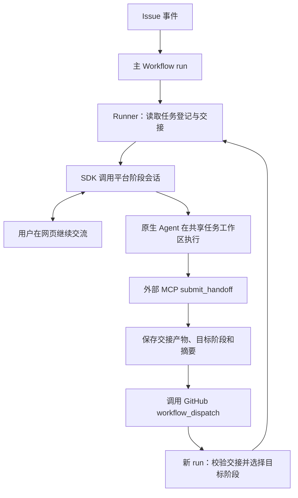

# GitHub CI + Agent Platform

[流程方案目录](README.md) · [方案比较](comparison.md)

## 定位与适用场景

GitHub 管理仓库事件、PR 和 CI 执行；常驻 Agent Platform 管理持久会话、原生执行与人机交互；外部 Pipeline 集成连接两者并维护业务阶段。适用于需要多轮澄清、持续网页交互、阶段返工和可复用 Agent 服务的研发任务。

维护源为本仓库平台源码及 `examples/github`。本文初始核对基线为 `2644d34eaa95677fc0abb66dfc3523150f2df5e2`；行为变更时随源码持续更新。产品实验使用 `big91987/reading_list`，但产品仓不是通用工具的维护源。

**当前业务编排仍在 GitHub Workflow 与外部集成中。平台尚未拥有完整的研发流程实例。**

## 已沉淀的能力与责任分工

| 层次 | 负责的内容 |
| --- | --- |
| GitHub | Issue、代码分支、PR、事件触发、Actions run、检查状态与分支保护 |
| 外部 Pipeline 集成 | 阶段路由、任务登记、交接回执、轮次、工作区、Git 操作、结果回贴、dispatch 与恢复协调 |
| 通用 Agent Platform | Agent 配置、账号与授权、持久会话、API/SDK、网页、执行队列、流式事件、工具注册和审批 |
| 原生执行器 | 模型对话、原生 Session、工具调用、Skill 加载、沙箱与原生执行 |
| 产品任务 | 需求、设计、代码、测试计划、QA 报告和阶段交付物 |

已实现的主要工作：

- Issue 一句话需求进入；Agent 判断澄清需求；任务可选择按推荐方案自主推进，保留目标无法确定或重大风险时的人类决策。
- Python SDK 与网页使用同一平台会话，Runner 传入持久任务工作目录，各角色保留自己的原生 Session。
- 按顺序呈现原生流式文本、工具事件和可用的思考摘要；工具细节可折叠，平台不生成冒充 Agent 的业务进展。
- 通过外部 stdio MCP 注册交接、补充、撤回工具，不把 GitHub 业务逻辑写成平台内置能力。
- 支持阶段返工、轮次隔离、过期交接拒绝、请求去重、已有会话接续和超时结果观察。
- 独立 QA、独立 Review、受控宿主浏览器与质量检查；Review 已补齐与 QA 相同的 `check`、`verify` 能力，但不挂载交接工具。
- 草稿 PR 交付、Ready PR 同步 main、产品冲突处理、独立复验，以及单独的框架维护 PR 验证路径。
- 可选本机部署、数据兼容声明、健康检查及连续合并时过期部署跳过。
- 将工具、模板、安装升级和说明收敛在本仓库的 `examples/github`，不依赖开发者手改数据库或测试仓临时补丁。

## 典型 Workflow

| GitHub 显示名 | 触发入口 | 主要工作 |
| --- | --- | --- |
| Agent Platform pipeline | 新建 Issue；`workflow_dispatch` | 按参数执行 requirements、design、development、qa、report、review 或辅助路径 |
| Refresh ready PRs | Ready PR 打开、重开、转 Ready、更新提交；main push；手动 | 判断是否需要同步主线和重新验证，派发 integrate；框架维护 PR 走维护者配置的验证 |
| Agent Platform Issue networking | Owner 评论 `/network allow`、`/network deny`、`/network default` | 调整单个 Issue 的联网策略 |
| Deploy reading list locally | main push；手动 | 产品仓的本机部署实例；可复用来源是 local-preview 示例，名称可随项目配置 |

主 Workflow 内的阶段是不同 job，不是每阶段一份 YAML。通常通过新 run 执行选中的阶段；`integrate` 可在同一个 job 内接续研发或 QA，`observe` 仅等待已有输入结果。因此不能严格概括为“一个 run 永远只对应一个业务阶段”。

## 正常交接与返回原理

交接输入包括 `summary`、`artifacts` 和适用的 `target_stage`。集成工具保存交接后向 GitHub dispatch 传入 Issue、来源/目标阶段、回执路径与摘要。接收方校验后，通过 SDK 创建或接续目标阶段会话。

正常前进与返工使用同一条交接链路：QA 可指定回 requirements、design 或 development；其他阶段也可按策略或用户要求回退。回退推进任务轮次，使旧回调不能推进新一轮。流程始终关联同一个 Issue、任务分支与工作区；各角色接续自己的会话，不共享成一个模型 Session。

dispatch 本身不取消旧 run。旧 run 在完成其工作后退出，新 run 受 CI 并发策略和任务锁约束。跨 run 的业务连续性由任务登记维护，不是 GitHub 原生“有环 DAG”。

## 补充、撤回、等待与恢复

- `submit_handoff` 返回 `run_id`、`run_url`，作为后续管理依据。
- `supplement_handoff` 将新增内容传给目标会话；目标未启动时保存至交接，启动后带入。
- `replace_handoff` 先使旧交接失效，确认旧 Agent 停止，取消相关未结束 run，再向指定阶段重新派发。失败保留可重试状态，不删除历史、不撤销已合并代码。
- 用户回复、执行队列和原生 Session 保存在平台；CI 等待超时不等于 Agent 停止。`observe` 接续观察原输入，不能借此重复启动 Agent。
- 工具默认审批策略可配置；常规提交、补充和已授权宿主检查默认自动，撤回默认确认。自主推进不等于放开全部权限或自动合并。

## PR 与部署

QA 交接给 report 后创建或更新草稿 PR。Ready PR 自动同步 main；有普通产品冲突时由研发处理，再经 QA、report 和独立 Review。`pipeline/refresh` 是这条集成链路的自定义检查，和负责派发的绿色 `refresh` job 不同。

`pipeline/refresh` 成功表示对应版本的验证和审查链路完成，不代表所有 Review 意见已被人工接受，也不代表可以自动合并。框架改动由维护者负责，不交给产品研发 Agent 任意修改共享控制文件。

合并 main 后，部署是独立 Workflow。正常合并依靠分支保护约束 QA/Review；管理员绕过保护不能被解释为检查通过。local-preview 示例自身执行静态检查、兼容声明和健康检查，不具有独立完整的部署前集成 QA。数据迁移计划进入审批，但该通用示例不负责自动执行数据库迁移，也不是任意后端部署器。详见 [部署边界](../../../examples/github/local-preview/README.md)。

## 当前验证边界

- [阶段交付与独立 QA/Review](../../03-delivery/qa-review-pipeline.md)：保留真实 Issue、run、会话及草稿 PR 证据；文中状态是历史快照。
- [全阶段回退验证](../../03-delivery/all-stage-return-e2e.md)：六条真实网页人工指定回退路径及后续前进已验证；不能据此宣称自主 QA 缺陷判断全覆盖。
- [交接管理验证](../../03-delivery/handoff-management-verification.md)、[引导与队列](../../03-delivery/steering-verification.md)：区分集成测试与实际用户操作证据。
- [近期故障与恢复记录](../../validation/2026-10-04-maintenance-and-resume.md)：记录主线同步、交付路径、宿主工具等修复及未测范围。
- Review 工具修复提交为 `2644d34`，示例回归 108 项通过并已通过正式安装入口应用到本机。既有会话仍保留工具快照，不会自动更新或自动批准旧请求。
- 单次 PR 的审批、合并或部署状态应查询实时记录；阶段级验证不能替代完整端到端矩阵，未完成项目见上述验证文档。

## 优点

- 网页对话、流式事件、工具审批与执行队列由平台统一提供，不需要把每句话变成一次 CI 触发。
- Agent 会话独立于 Workflow run 保存，同一能力可服务网页、SDK 与其他外部系统。
- 外部工具表达交接、补充和撤回，平台不需要内置 GitHub 研发阶段。
- 保留 GitHub 的代码协作、PR、分支保护及部署入口，能够渐进接入已有工程环境。

## 局限与代价

- 增加平台服务、数据库、账户和接口的运维成本。
- 业务状态、执行状态和 GitHub run 仍分布在多处，需要处理回执、去重、过期事件与恢复的一致性。
- 查看完整进度仍可能跨 Issue、Actions 和平台会话；修改阶段路由仍要维护 YAML 与集成脚本。
- 当前依赖可信同机工作区与持久目录；这不是分布式沙箱调度或多租户隔离方案。
- 既有会话保留工具配置快照，升级默认配置不等于自动迁移所有在途会话。

## 安装、升级与责任边界

安装以 [GitHub 接入指南](../../../examples/github/GETTING_STARTED.md) 和 [Pipeline 工具说明](../../../examples/github/README.md) 为准。Skill 作为独立资产安装；历史 he_skeleton 仓库不是当前方案的必装依赖。

通用修复落到平台源码或 examples，再通过正式安装升级路径应用；产品仓保留产品代码和 Owner 配置。源仓库 PR 由用户决定合并。不能仅修测试仓、手改会话或用临时恢复代替可复用交付。
