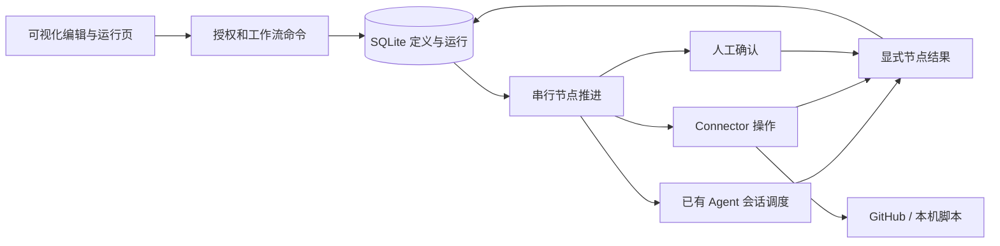

# 平台内 Workflow

状态：首版实现基线，2026-10-05；按用户授权选择推荐方案。需求见 [Workflow PRD](../../01-product/workflows.md)，进度见 [交付计划](../../03-delivery/workflows-plan.md)。本页描述目标契约，完成情况以验证记录为准。

## 目标架构与责任

现有 Go 服务增加持久工作流编排。SQLite 保存定义、运行及节点执行事实；已有 Scheduler 执行 Agent 会话；Connector 执行受配置约束的外部操作。可视化编辑器操作同一 HTTP API。图、节点名与路由均由配置提供。

平台事实源为 SQLite；GitHub 是外部代码与协作资源的事实源；工作区保存实际文件。GitHub Actions 可继续做外部验证或部署，但节点推进不要求创建新的 CI run。

## 数据与命令契约

- Workflow：ID、名称、启用、revision、入口、节点与边。节点使用定义内稳定键，类型为 agent／connector／approval／end，坐标属于编辑信息。边由 source、route、target 唯一定位。保存以 revision 乐观并发控制，避免两个编辑页面互相覆盖。
- Connector：ID、名称、操作类型、固定目标和环境变量凭据引用。只允许管理员配置和检查；导出不包含密钥。初版 GitHub 与本机命令覆盖真实示例，新增类型必须有实际验证需求。
- Run：ID、Workflow revision 和冻结定义、所有者、输入、工作区、状态、当前执行序号、时间。请求键在用户范围内唯一，内容不同的同键提交返回冲突。
- 节点执行：使用 run_id + 单调序号定位，记录 node_id、状态、会话 ID、输入／结果、选定 route 和错误。循环产生新执行序号，旧执行不覆写。

HTTP：`/api/workflows` 创建／列举；`/api/workflows/{id}` 查询／版本保存；`/api/connectors` 配置；`/api/workflow-runs` 启动／列举；`/api/workflow-runs/{id}` 读取历史；其下 `/decision`、`/stop`、`/resume`、`/return` 处理运行命令。保存／操作复用登录、CSRF 和错误格式。管理员编辑配置；运行所有者与管理员操作运行。每个 Agent 引用仍须校验原 Agent 授权。

定义校验：唯一节点键、存在的入口和边端点、同源 route 不重复、全部节点可达、每个节点存在可到达结束的路径。允许有退出路径的循环；限制图大小和每个运行最大执行次数。入口替代必须来自显式允许列表，验证所需输入，不能用隐藏参数略过权限。

## Agent 接力与人工反馈

每次 Agent 节点执行关联平台持久会话，保存选定 Agent 配置快照与共享工作区，输入包含任务、前序可消费结果和合法 route。用户在原会话澄清，不自动推进。

通过通用的节点结果工具 `registered_workflow_node.complete_node` 提交 route、摘要及产物引用。该工具通过平台 HTTP MCP 入口按节点作用域挂载；不改写全局 Agent 资产。用户消息保留任务原文，冻结的节点指令和前序结果进入私有会话配置。工具获得只对应本次节点执行的权限，校验 run、序号、当前节点和合法出边；不能任意操作其他运行。工具业务只做“完成当前节点”，研发专用阶段逻辑留在模板和 Skill。工具提交结果先持久保存；待该节点 Agent 当前轮和队列静止后才允许下一节点开始，避免旧节点继续写共享文件。

人工节点保存待决内容，用户按配置 route 批准或拒绝。正式入口使用 `seq` 检查页面是否过期；不会把旧审批套用到已经回退的新执行。自然语言修改先交给 Agent；其建议可进入人工节点确认。运行控制的直接回退操作必须先停止当前执行并确认静止，再使旧执行失效、创建目标节点新执行。旧执行的交接和晚到回执返回冲突。

## 推进、幂等与恢复

运行状态：running、waiting、stopping、stopped、failed、completed。节点执行状态：pending、running、waiting、stopped、completed、failed、cancelled。运行完成必须到达 end；Agent 的会话 idle 不能替代节点完成。

在事务内核验当前执行、写入结果、选出边并创建下一次 pending 执行。一个执行只能提交一次确定结果；相同重复结果返回原回执，不同结果冲突。领取节点使用比较并更新。SQLite 单连接事务内不得嵌套调用等待另一个数据库连接的方法。

Agent 会话创建使用稳定请求键，恢复可找回原会话；不得替换原生会话掩盖失败。Connector 发起动作前持久记录 running，外部成功后保存回执；若中间崩溃，按配置的外部关联键查询结果，无法确定则 failed 并明确“结果未知”，不自动重放写操作。GitHub 评论／PR 使用关联标记或唯一分支进行查询核验；命令默认不宣称幂等。

停止后不分发后续节点；当前节点结果被接受后，旧会话不再接收新输入，用户从运行页选择回退。已被 Run 引用的会话不可单独删除。运行中的本机执行经现有停止链路终止。重启后等待审批保持等待；正在执行的外部动作进入核验／失败状态；完成记录保留。恢复命令说明其作用，不删除已产生外部资源。数据目录沿用独占锁，首版只支持一个编排服务进程。

## Connector 与边界

GitHub 操作使用受控 repo、操作枚举、参数 Schema 和凭据引用；任务文本是数据，不拼接 shell。命令 Connector 由管理员提供 executable、参数数组、允许目录及超时，不接收任意模型生成 shell。错误保留退出码和有界日志，敏感字段不写入消息或导出。

Graph 不增加 Agent 沙箱或提权能力，现有工具审批保持有效。用户可启动的图必须同时拥有节点 Agent 和 Connector 使用权限；管理员配置的执行能力不因图可见而自动公开。

## 部署、升级与兼容

复用 Go、SQLite 与内嵌网页，新增表以可重复迁移创建，原会话数据不重写。新工作区、独立数据目录和端口验证，现有平台和测试仓库不承载新功能试验。模板位于 examples/platform-workflows，包含导入配置、安装接入和测试仓库说明。服务升级保留定义与运行快照；运行不静止时拒绝破坏性迁移。

## 方案选择与代价

| 方向 | 收益 | 代价／成立条件 |
|---|---|---|
| 保持 CI 外部编排 | 复用现有交付体系 | 无法直接满足平台内低代码和单运行循环目标 |
| 平台单机持久编排（采用） | 复用会话、身份、存储；可直接控制节点 | 必须实现并验证副作用恢复与运行状态机；同机串行节点范围 |
| 引入独立编排服务 | 可复用成熟集群调度 | 增加服务、状态映射和部署负担，现阶段缺乏规模依据 |

采用第二项为用户授权下的实施选择。后续真实多机或并行需求出现时，保留外部节点结果契约，重新评估执行层；本轮不提前建立插件 ABI 或分布式事件总线。

## G2 自查

结果：`Ready with Non-blocking Gaps`。核心职责、状态、接口、失败与安装路径明确。节点完成工具的真实原生集成和外部未知结果恢复为首要验证任务，未验证之前不开放为完成能力。产品方向无待决问题；按交付计划先实现最小纵向切片。

## 当前实现与恢复操作

T2 已实现图版本冻结、持久 Run／执行序号、Agent 会话原子创建与绑定、作用域完成工具、人工路由、停止／恢复／人工回退。网页从工作流的“运行”入口启动，运行页显示节点历史并链接原会话；会话提供“返回工作流运行”入口。Connector 仍待 T3，包含该节点的图暂不可启动。

- Agent 完成工具先保存结果，待会话 idle 且输入队列清空后，在事务中关闭旧会话并创建下一执行。存在排队或引导中的用户消息时拒绝交接。
- `/stop` 等待原生进程退出后变为 stopped；`/return` 仅在 stopped 时接受目标节点与回退原因，旧节点记为 cancelled，并把原因传给新执行。回退改变执行位置，不撤销已有文件修改或外部副作用；新节点需检查并修订已有产物。
- `/resume` 对未完成 Agent 要求明确继续说明，复用同一会话，不重放已失败或已停止的用户轮次。已接受交接但执行随后中断时，不自动消费该结果；检查产物后停止并选择回退目标。
- 重启时未确定结果的 Agent 会话沿原有恢复机制标为失败；编排进入需处理状态。等待人工确认的节点与已完成运行保持原状。
- Agent 和 Workflow 权限在分发时重新检查；运行页仅所有者／管理员可查看操作。手工审批接口不能伪造 Agent 节点完成结果。

以上行为的真实验证范围与未测限制见交付验证记录。
