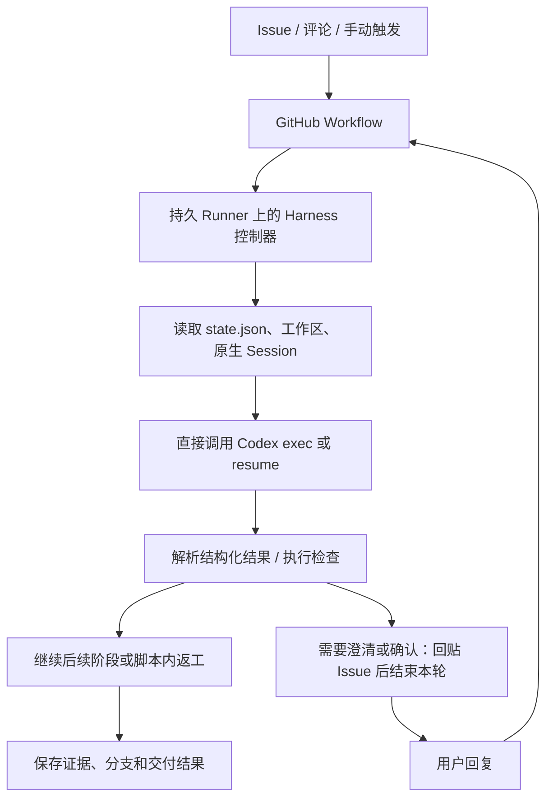

# CI/CD Runner 直接调用 Agent

[流程方案目录](README.md) · [方案比较](comparison.md)

## 定位与适用场景

由 CI/CD Runner 内的 Harness 直接调用 Agent，并管理任务状态与执行现场。适用于以代码仓库为中心、流程较固定、人机交互较少的批处理研发任务。

本方案已有历史实验实现，来源为 `big91987/he_skeleton`；以下以提交 `0f84db35407393293b459c57596a697577fd18f5` 为核对基线。它不是 Agent Platform 当前 GitHub 接入方案的安装依赖，也不因后续引入平台而失去独立适用性。

## 组成与两次迭代

这一方案没有常驻 Agent Platform。GitHub 接收任务及用户回复，Runner 内的 Harness Python 程序直接启动本机 Codex，并维护任务状态、工作区、原生调用记录及验证产物。

必须区分两个历史版本：

- **早期 `/harness` 版本**：由 `harness/loop.py` 控制澄清、实施、有限修复和结果发布。依靠持久任务历史与工作区启动下一次调用；不能把它描述为恢复同一个原生 Session。
- **后来的 Full Workflow**：由 `full_harness/runner.py` 控制阶段，`full_harness/codex.py` 使用 `codex exec` / `codex exec resume`，保存原生 Session。使用 JSON Schema 接收机器可判断的结果；原生 JSON 事件同时写入私有日志，并在 Actions 转发执行进展。

Full Workflow 的可见主阶段包含 entry、requirements、design、development、report，另有入口授权 job。开发阶段内部还包含计划、实现、实际检查、独立 Session 审查及返工，不应把 job 数量当成全部业务步骤数量。

## 典型用户旅程与触发

1. 用户在 GitHub 发需求；不同历史入口使用标签、`/harness`、`/develop`、自然语言评论或手动执行，触发条件由对应版本 YAML 与入口控制器共同决定。
2. Runner 恢复持久目录，读取任务状态，选择当前阶段并直接调用 Agent。
3. Agent 需要用户信息时，控制器把问题和阶段材料发到 Issue，保存状态并结束本轮；用户回复后由新 run 恢复。
4. 无需等待时，YAML 中后续 job 可在同一个 run 中继续；部分修复循环在 Python 控制器内部执行。
5. 检查、独立评审及阶段要求满足后，控制器交付任务分支或 PR；人工决定合并。

**这里并不是每个阶段都 dispatch 新 run。** 也不是“纯 YAML 完成了任意循环”：YAML 的依赖图组织 jobs，循环、暂停和恢复由 Runner 脚本补足。

## 状态、能力与限制

| 事项 | 历史方案的实现 |
| --- | --- |
| 任务状态 | Runner 持久目录中的状态文件、阶段、反馈、已处理事件和检查点 |
| 原生会话 | Full 版本保存原生 Session ID 并 resume；早期版本不能作同样声明 |
| 用户确认 | Full 版本记录待确认产物摘要、评论时间与确认依据；泛泛的“继续”不等于审批 |
| 工具与检查 | 原生 Skill、MCP 浏览器、Stop Hook、项目配置的验证命令 |
| 日志与产物 | Actions 运行日志、Issue 评论、Artifact；部分历史版本提供 Pages 预览 |
| 返工 | 控制器依据审查结果回到相应阶段，脚本内有有界修复循环 |
| 执行位置 | 要求同一台持久 Runner；本地状态不能天然随任意 Runner 迁移 |

## 优点与局限

优点：组件少，不需要另建对话服务；代码、讨论、权限与执行记录集中在 GitHub；对固定、批处理式研发任务，上手与维护成本较低；项目容易按自身需要修改 YAML 和检查命令。

不足：用户多轮对话依赖 Issue 评论和反复启动 run；Agent 进程生命周期与 CI job 紧密耦合；Runner 不仅执行，还承担会话、状态机、审批和恢复职责；任务状态与证据分散，定位长流程阻塞不直观；脚本越做越复杂，逐渐演变成藏在 CI 中的编排器。

## 历史来源与验证边界

固定版本材料：

- [源仓库说明与历史入口](https://github.com/big91987/he_skeleton/blob/0f84db35407393293b459c57596a697577fd18f5/README.md)
- [Full Workflow YAML](https://github.com/big91987/he_skeleton/blob/0f84db35407393293b459c57596a697577fd18f5/templates/full/.github/workflows/harness-full.yml)
- [阶段运行器](https://github.com/big91987/he_skeleton/blob/0f84db35407393293b459c57596a697577fd18f5/full_harness/runner.py)
- [Codex 调用适配](https://github.com/big91987/he_skeleton/blob/0f84db35407393293b459c57596a697577fd18f5/full_harness/codex.py)
- [历史验证记录](https://github.com/big91987/he_skeleton/blob/0f84db35407393293b459c57596a697577fd18f5/docs/full-workflow-validation.md)

历史记录包含真实原生 Session、Skill、Stop Hook 和部分完整阶段实验；也明确保留了当时未完成的 GitHub 真实交付、后续入口分类及三阶段线上验证。不能把离线控制器测试或早期 CLI 实验等同于每个版本均已完成真实 GitHub 端到端验证。不同历史文档描述不同迭代，本归档不倒改它们的当时结论。

## 维护与复用

本页维护方案原理、边界与历史实现依据；执行工具继续由原来源维护，不在平台仓复制另一份运行代码。历史 YAML 与项目配置由各自 Owner 管理，采用某个版本时须同时核对入口、控制器和安装说明，不能混用不同迭代的触发方式与恢复语义。
